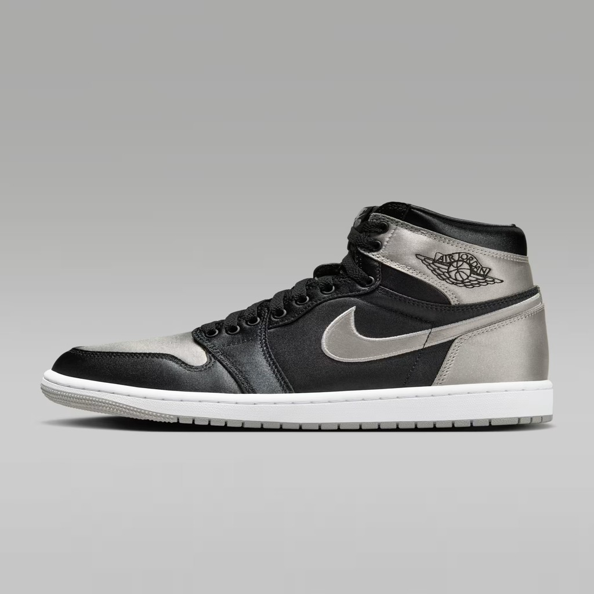

H-003 | The AI Creative Studio

Track: Generative AI & Marketing Tech

A local-first pipeline that converts a single product image into multiple ad-ready creative variants with AI-generated captions and an export-ready ZIP bundle in under 30 seconds.

1. The Problem (Real-World Scenario)

 Modern advertising is built on rapid experimentation — testing visuals, messaging, and formats across digital platforms.

However, producing creative assets is:

i. Time-consuming

ii. Repetitive

iii. Manual

iv. Difficult to scale

v. Even a basic campaign requires:

vi. Multiple product images

vii. Multiple caption variations

viii. Exporting and packaging assets

This slows down experimentation, delays insights, and increases cost per iteration.

2. The Solution

The AI Creative Studio automates this workflow.

Users supply one product image, and the system generates:

Multiple creative image variants

Short, high-impact ad captions

A packaged ZIP bundle for deployment

The entire workflow becomes:

Drop → Generate → Deploy

Eliminating manual editing, copywriting, and exporting.

3. Expected End Result
Input

A product image placed in the input directory.

Action

Run the pipeline.

Output

A complete creative asset kit, including:

6 creative image variants

6 AI-generated ad captions

ZIP bundle with all assets

Example Captions
Elevate your style with every step
Comfort engineered for all-day motion
Performance and aesthetics in one silhouette

This enables fast creative iteration without designers or external tools.

4. Technical Approach

The system was designed to be:

Lightweight

Fast

Reliable

Cost-free

Local-first

Avoiding dependency on unstable or expensive image generation APIs.

Architecture
1. Local Image Processing (Pillow)

Generates stylistic variants from a single image:

Warm tone

Cool tone

High contrast

Posterized

Blur background

Standard cleaned

2. AI Caption Generation (Gemini Flash)

Creates short, performance-optimized ad copy using constrained prompting:

Rules:

Max 10 words

Punchy, modern tone

No bullets or numbers

One caption per line

3. Packaging

All images and captions are zipped automatically into a shareable bundle.

5. System Workflow
product.jpg
    ↓
local creative transformations
    ↓
AI caption generation
    ↓
asset packaging
    ↓
deployable zip bundle

6. Tech Stack
Component	Technology
Language	Python 3.11
Image Engine	Pillow
AI Model	Google Gemini Flash
Config	python-dotenv
Packaging	zipfile
Orchestration	Python script
Why this stack?

Fast

Cheap (free)

Reliable

Easy to run locally

Zero GPU requirements

7. Challenges & Learnings
1. Unreliable AI Image APIs

Attempts with remote models failed due to:

Permission issues

Version mismatches

Rate limits

Fix: Move image generation fully offline.

2. Controlling AI Output

Initial captions were verbose and inconsistent.

Fix: Strict prompt rules and output cleanup.

Result: Short, clear, and usable ad copy.

8. Visual Proof (Sample Output)

Example generated variant:

(Additional variants available in the repository.)

9. Output Structure
assets/output/
├── images/
│   ├── creative_1.jpg
│   ├── creative_2.jpg
│   ├── creative_3.jpg
│   ├── creative_4.jpg
│   ├── creative_5.jpg
│   └── creative_6.jpg
├── captions/
│   └── captions.txt
└── creatives_bundle.zip

10. How to Run Locally
1. Clone Repository
git clone https://github.com/thought1003/groundtruth-hackathon.git
cd groundtruth-hackathon

2. Install Dependencies
pip install pillow google-generativeai python-dotenv

3. Configure API Key

Create .env file with:

GEMINI_API_KEY=your_key_here

4. Add Input Image

Place a product image at:

assets/input/product.jpg

5. Run Pipeline
python -m src.main

11. Result & Impact

The AI Creative Studio provides:

Rapid creative generation

Zero manual editing

Deployable assets in seconds

This enables faster experimentation, lower execution cost, and seamless deployment.

12. Future Work

Planned enhancements:

Background generation

Style presets

Platform-specific export formats

Brand color extraction

Bulk processing

Web-based UI

13. Metadata

Problem ID: H-003

Name: The AI Creative Studio

Track: Generative AI & Marketing Tech

Status: MVP Implemented

Timeline: December 2025

Author: Aryan Singh

🏁 Summary

This system automates creative production end-to-end, generating image variants, ad captions, and exportable assets from a single input image — enabling faster iteration and scalable experimentation for modern marketing teams.
